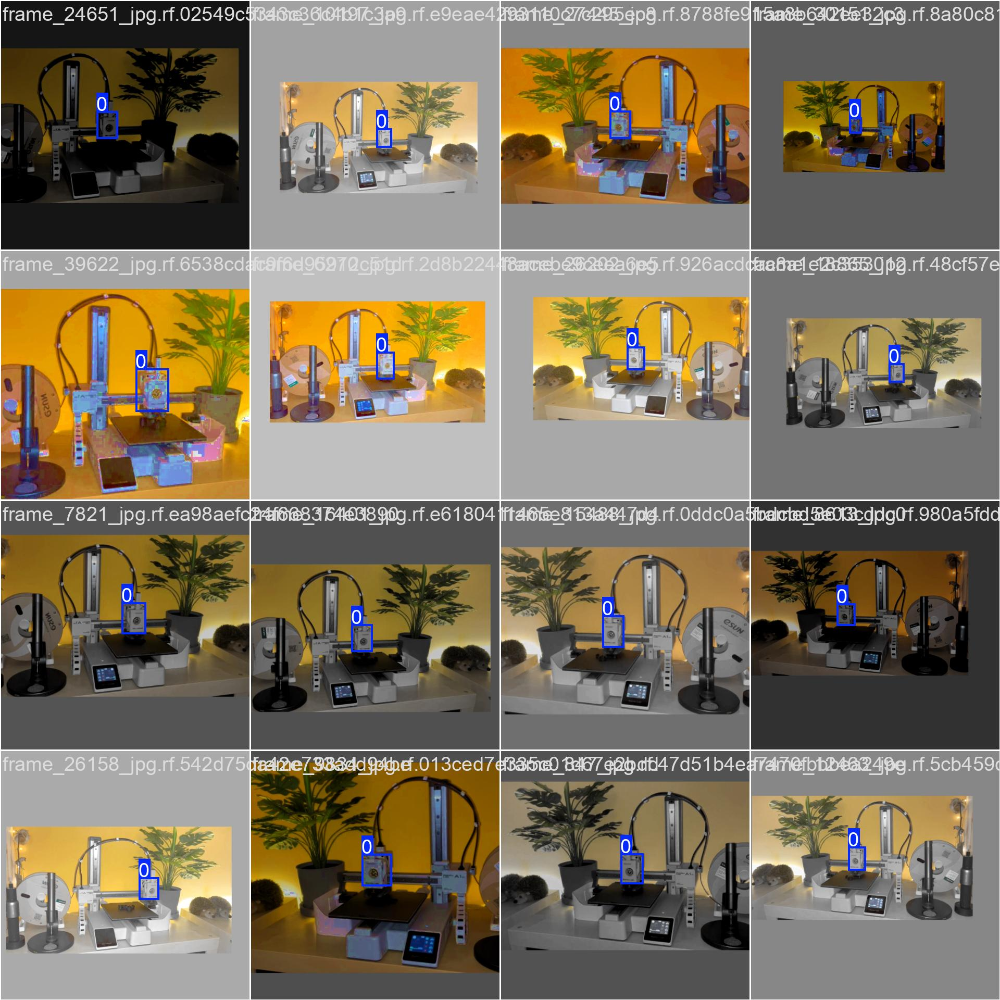
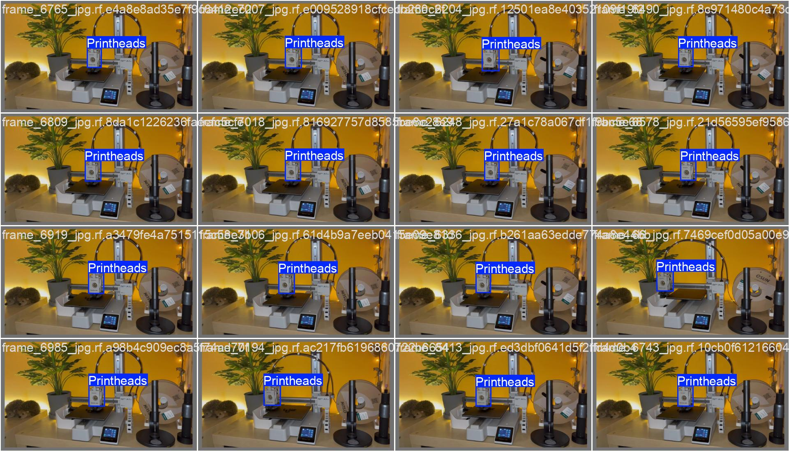
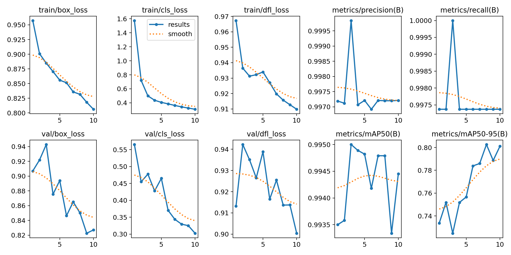

# Dont-Blink AI - Printhead Tracking  

## Overview  
This project aims to create an **AI-powered timelapse system for 3D printers**, where the camera automatically takes a picture **only when the printhead is out of the frame**. The goal is to generate clean timelapse videos without the printhead obstructing the view.  

### **Demo Video**  
<p align="center">
  <a href="https://youtu.be/nMrHcGVqUqU">
    
  </a>
</p>

---

## **How It Works**  
- A **YOLOV8 model** detects the printhead in each frame.  
- If the printhead **is not in the way of the print**, a **photo is taken**.  
- The system runs in real-time and works alongside the **3D printer's movement logic**, ensuring optimal capture timing.  

---

## **How to Use**  

### **1. Download the Application**  
- Download the latest release from [here](#).  
- Install the application on your system.  

### **2. Choose Input Source**  
You can select one of the following options:  
- **Live Camera**: Use a connected webcam to track the printhead in real-time.  
- **Video File**: Process an existing video file (.mp4) and extract timelapse frames. (coming soon)

### **3. Configure Output Folder**  
- Select a folder where the images will be stored.  

### **4. Start Processing**  
- Click **"Start Processing"** to begin capturing images when the printhead is out of the frame.  

### **5. Stop Processing & Create Timelapse**  
- Once your print is finished, click **"Stop Processing"**.  
- Click **"Create Timelapse"** to generate an **MP4 file** in the selected output folder.  

### **Supported Printers**  
- Currently optimized for **Bambulabs A1 Mini**.  

---

## **First Prototype - Initial Results**  

### **Training Data Samples**  
We trained the model using captured images of different printhead positions.  

#### **Example Training Batch**  
  

#### **Labeled Validation Batch**  
  

---

### **Results of the First Prototype**  
After training, the model's first results show promising detection accuracy. Here’s an overview of detections in sample frames:  

  

- The system **accurately avoids taking pictures when the printhead is in the frame**.  
- Works in **real-time**, ensuring smooth operation alongside the 3D printer’s layer movements.  
- Further improvements will focus on **faster detection and better handling of lighting conditions**.  

---

## **Citation**  

```bibtex
@software{yolov8_ultralytics,
  author = {Glenn Jocher and Ayush Chaurasia and Jing Qiu},
  title = {Ultralytics YOLOv8},
  version = {8.0.0},
  year = {2023},
  url = {https://github.com/ultralytics/ultralytics},
  orcid = {0000-0001-5950-6979, 0000-0002-7603-6750, 0000-0003-3783-7069},
  license = {AGPL-3.0}
}
